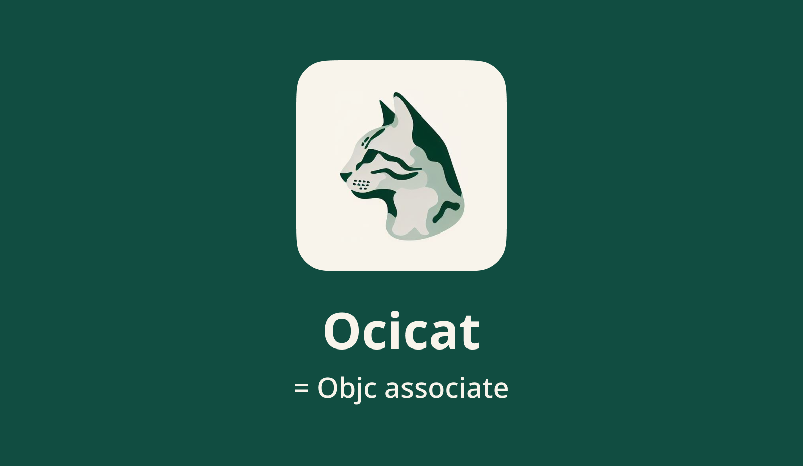

Ocicat uses Objective-C associated objects to allow you to define stored properties in Swift extensions.

For concret types, you can do it like this:

```swift
extension SomeType {
    @Ocicated
    var task: SomeTask?

    @Ocicated
    weak var delegate: SomeDelegate?
}
```

For protocol extensions, you need to declare your own keys, like this:

```swift
private #Keys("keyToTask", "someOtherKey")

extension SomeProtocol {
    // the key's name is prefixed with `Keys.`
    // to reference keys generated by the #Keys macro
    @Ocicated(key: "Keys.keyToTask")
    var task: SomeTask?
}
```


## How to Use It?

Alright. As long as you've [added this package in Xcode](https://developer.apple.com/documentation/xcode/adding-package-dependencies-to-your-app), when you attempt to compile, Xcode will ask you whether to trust and allow this macro package in the form of an error message. To be honest, I haven't tried what happens if you choose not to allow it, so...


## Custom Keys and Sources

### Custom Keys

#### 1. The `#Keys` Macro

For protocols, since Swift does not allow the declaration of static variables within protocol extensions, you'll have to manually declare your key.

The example above uses the `#Keys` macro to generate keys:

```swift
private #Keys("keyToTask", "someOtherKey")

extension SomeProtocol {
    @Ocicated(key: "Keys.keyToTask")
    var task: SomeTask?
}
```

This piece of code expands to:

```swift
private enum Keys {
    static var keyToTask: Void?
    static var someOtherKey: Void?
}

extension SomeProtocol {
    var task: SomeTask? {
        get {
            ObjcWrapper.get(from: self, by: &Keys.keyToTask) as? SomeTask
        }
        set {
            ObjcWrapper.save(newValue, into: self, by: &Keys.keyToTask)
        }
    }
}
```

As you can see, the `#Keys` macro works by declaring an enum named `Keys` and defining the keys you need within it. Therefore, in the `@Ocicated(key: "Keys.keyToTask")` macro, `Keys.keyToTask` actually refers to the key path within the `Keys` enum.


#### 2. Use Arbitrary Keys

You can use any key by specifying its key path:
```swift
private var theFavoredKey: Void?

extension SomeType {
    @Ocicated(key: "theFavoredKey")
    var task: SomeTask?
}
```

This code will expand to:
```swift
private var theFavoredKey: Void?

extension SomeType {
    var task: SomeTask? {
        get {
            ObjcWrapper.get(from: self, by: &theFavoredKey) as? SomeTask
        }
        set {
            ObjcWrapper.save(newValue, into: self, by: &theFavoredKey)
        }
    }
}

```


#### 3. Define Your Own "Keys" Structure

If you prefer not to use the automatically generated `Keys` namespace by `#Keys`, you can define your own structure and declare your keys in it. To simplify this process, Ocicat provides a macro for adding keys to a type:

```SWIFT
@AddKeys("key1", "key2")
struct MyKeys {
    
}
```

This code will expand to:

```swift
struct MyKeys {
    
    static var key1: Void?

    static var key2: Void?
    
}
```

In this case, your Ocicat macro should be:

```swift
@Ocicated(key: "MyKeys.key1")
```

This allows you to access the key "key1" within your custom `MyKeys` structure.


### Custom Sources

Ocicat defaults to using `self` as the source, but you can specify other variables as the source:

```swift
private var source = SomeType()

extension SomeType {
    @Ocicated(source: "source")
    var task: SomeTask?
}
```

In this example, the variable `source` is used as the source for the `@Ocicated` macro instead of the default `self`.

Certainly, you can combine custom sources with custom keys:

```swift
private #Keys("key")

private var source = SomeType()

extension SomeType {
    @Ocicated(source: "source", key: "Keys.key")
    var task: SomeTask?
}
```

In this example, you are using a custom source (`source`) and a custom key (`Keys.key`) with the `@Ocicated` macro.


### Custom Getter & Setter


## How Code Expands

Here is how the code mentioned above expands.

### For concret types

```swift
extension SomeType {
    @Ocicated
    var task: SomeTask?

    @Ocicated
    weak var delegate: SomeDelegate?
}
```

The above code will expand to:

```swift
extension SomeType {
    var task: SomeTask? {
        get {
            ObjcWrapper.get(from: self, by: &Self.keyToTask) as? SomeTask
        }
        set {
            ObjcWrapper.save(newValue, into: self, by: &Self.keyToTask)
        }
    }    
    
    fileprivate static var keyToTask: Void?
    
    weak var delegate: SomeDelegate?
        {
        get {
            ObjcWrapper.get(from: self, by: &Self.keyToDelegate) as? SomeDelegate
        }
        set {
            ObjcWrapper.saveWeakReference(to: newValue, into: self, by: &Self.keyToDelegate)
        }
    }
    
    fileprivate static var keyToDelegate: Void?
}
```

Basically, Ocicat defines a fileprivate static variable inside `SomeType` as a key, following the naming format "keyTo." It then defines a getter and a setter, and uses `ObjcWrapper` to invoke Objective-C methods for getting and setting values.

Ocicat offers an experience that closely resembles native Swift variables as much as possible. As shown in the above code, Ocicat can automatically support weak references. 

Meanwhile, if you define a non-optional variable, Ocicat will require you to provide a default value to avoid nil values. If you want to bypass this limitation, you can define the variable as a force-unwrapped one. For example, this won't compile:

```swift
extension SomeType {
    @Ocicated  // ❌ You must initialize non-optional variables to provide them with a default value.
    var state: SomeState
}
```

You need to provide a default value, by initializing it:

```swift
extension SomeType {
    @Ocicated
    var state: SomeState = .empty
}
```

Or, if you are absolutely certain that you will assign a value to it beforehand:

```SWIFT
extension SomeType {
    @Ocicated
    var state: SomeState!
}
```


